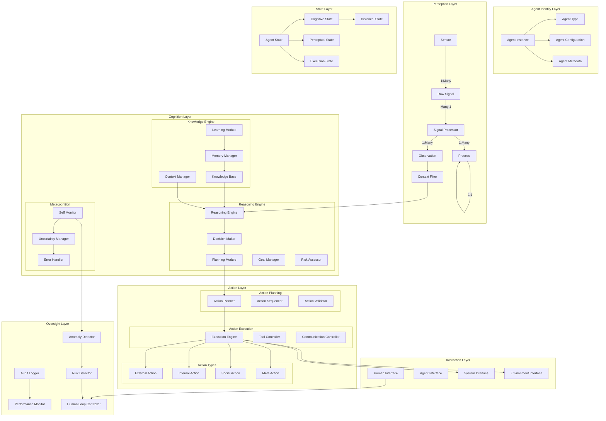

# Enhanced Agent Log Ontology

## Overview

This enhanced ontology provides a comprehensive, agent-agnostic abstraction layer for capturing, monitoring, and analyzing AI agent behaviors. It's designed to support enterprise-scale oversight platforms that need to monitor diverse agent types while maintaining philosophical completeness.

## Architecture

The ontology is structured into seven interconnected layers:



## Layer Descriptions

### 1. Agent Identity Layer

Captures the fundamental identity and capabilities of an agent.

**Key Components:**
- **AgentInstance**: Core agent representation with unique ID, name, and type
- **AgentType**: Classification (conversational, task-execution, reasoning, learning, hybrid)
- **AgentCapability**: Individual capabilities with version and constraints
- **AgentConfiguration**: Runtime configuration including model, parameters, and limits
- **AgentMetadata**: Creation info, documentation, and custom metadata

### 2. Perception Layer

Handles all input processing from sensors to observations.

**Key Components:**
- **Sensor**: Input sources (text, API, database, environment)
- **RawSignal**: Unprocessed sensor data
- **SignalProcessor**: Transforms signals into observations
- **Observation**: Processed, contextualized information
- **Process**: Signal processing workflows
- **ContextFilter**: Relevance and priority filtering

### 3. Cognition Layer

The "brain" of the agent, handling reasoning, knowledge, and metacognition.

**Sub-systems:**

#### Reasoning Engine
- **Reasoning**: Inference processes (deductive, inductive, probabilistic)
- **Decision**: Choice selection with criteria and confidence
- **Goal**: Hierarchical objectives with success criteria
- **Plan**: Execution strategies with dependencies
- **RiskAssessment**: Evaluation of plan/decision risks

#### Knowledge Engine
- **KnowledgeItem**: Stored information with confidence scores
- **Memory**: Episodic and working memory management
- **LearningEvent**: Knowledge updates and adaptations
- **Context**: Current operational context

#### Metacognition
- **SelfAssessment**: Performance self-evaluation
- **Uncertainty**: Tracking and managing unknowns
- **ErrorEvent**: Failure detection and recovery

### 4. Action Layer

Manages planning and execution of agent actions.

**Sub-systems:**

#### Action Planning
- **ActionPlan**: Detailed action specifications
- **ActionSequence**: Ordered action workflows
- **ActionValidation**: Pre-execution validation

#### Action Execution
- **ActionExecution**: Runtime action records
- **ToolInvocation**: External tool usage
- **CommunicationAction**: Message exchanges

#### Action Types
- **ExternalAction**: Environment modifications
- **InternalAction**: Self-modifications
- **SocialAction**: Multi-agent interactions
- **MetaAction**: Actions about actions

### 5. State Layer

Comprehensive state management across all agent aspects.

**Key Components:**
- **AgentState**: Overall agent status and health
- **ExecutionState**: Current execution phase and tasks
- **CognitiveState**: Mental state including goals and attention
- **PerceptualState**: Sensor and observation status
- **HistoricalState**: State history and checkpoints

### 6. Interaction Layer

Manages all communication interfaces.

**Interface Types:**
- **HumanInterface**: Human-agent interaction
- **AgentInterface**: Agent-agent communication
- **SystemInterface**: API and system integration
- **EnvironmentInterface**: Physical/virtual environment interaction

**Communication:**
- **Message**: Structured communication units
- **Conversation**: Multi-turn interaction sessions
- **ProtocolSpecification**: Communication protocols
- **InteractionPolicy**: Access control and permissions

### 7. Oversight Layer

Critical for enterprise deployment - monitoring, compliance, and control.

**Key Components:**

#### Anomaly Detection
- **Anomaly**: Detected deviations from normal behavior
- **AnomalyDetector**: Detection algorithms and rules

#### Risk Management
- **Risk**: Identified risks with probability and impact
- **RiskAssessment**: Comprehensive risk evaluation

#### Performance Monitoring
- **PerformanceMetric**: KPIs and metrics
- **PerformanceReport**: Aggregated performance analysis

#### Compliance & Audit
- **AuditEvent**: Immutable action records
- **ComplianceCheck**: Policy and regulation verification

#### Human-in-the-Loop
- **HumanReviewRequest**: Escalation for human decision
- **HumanIntervention**: Human override records
- **EscalationPolicy**: Automatic escalation rules

## Usage Examples

### Creating an Enhanced Agent Run

```python
from agent_log_ontology.ontology import (
    EnhancedAgentRun,
    EnhancedAgentStep,
    AgentInstance,
    AgentType,
    AgentConfiguration,
    AgentMetadata
)
from datetime import datetime

# Create agent instance
agent = AgentInstance(
    id="agent-001",
    name="Customer Support Bot",
    types=[AgentType.CONVERSATIONAL, AgentType.TASK_EXECUTION],
    configuration=AgentConfiguration(
        model_id="gpt-4",
        parameters={"temperature": 0.7}
    ),
    metadata=AgentMetadata(
        created_at=datetime.utcnow(),
        created_by="system",
        version="1.0.0"
    )
)

# Create run
run = EnhancedAgentRun(
    id="run-001",
    name="Customer inquiry handling",
    agent=agent,
    start_time=datetime.utcnow()
)

# Add steps with full ontology support
step = EnhancedAgentStep(
    id="step-001",
    name="Process customer message",
    step_number=1,
    start_time=datetime.utcnow(),
    perception_state=perception_snapshot,  # Full perception data
    cognition_state=cognition_snapshot,    # Reasoning and decisions
    action_state=action_snapshot,          # Actions taken
    oversight_state=oversight_snapshot     # Monitoring data
)

run.add_step(step)
```

### Converting from OpenAI Traces

```python
from agent_log_ontology.connectors import from_openai_trace_enhanced
import json

# Load OpenAI trace
with open("openai_trace.json") as f:
    trace_data = json.load(f)

# Convert to enhanced ontology
enhanced_run = from_openai_trace_enhanced(trace_data)

# Access comprehensive data
print(f"Agent type: {enhanced_run.agent.types}")
print(f"Total observations: {enhanced_run.total_observations}")
print(f"Risk events: {len(enhanced_run.risk_events)}")

# Get timeline of events
timeline = enhanced_run.get_timeline()
for event in timeline:
    print(f"{event['timestamp']}: {event['type']} - {event['step_name']}")
```

## Implementation Strategy

### Phase 1: Core Implementation
1. Deploy basic layer implementations
2. Create simple connectors for common formats
3. Implement basic oversight hooks

### Phase 2: Integration
1. Build adapters for major agent frameworks
2. Implement streaming data ingestion
3. Create real-time monitoring dashboards

### Phase 3: Advanced Features
1. Deploy ML-based anomaly detection
2. Implement sophisticated risk assessment
3. Build human-in-the-loop workflows

### Phase 4: Enterprise Scale
1. Add compliance frameworks
2. Implement audit trails
3. Build multi-tenant support

## Key Design Principles

### 1. Philosophical Completeness
Every possible agent behavior can be represented within this ontology.

### 2. Flexibility
Agents can implement subsets of the ontology based on their capabilities.

### 3. Oversight-First
Monitoring and control are built into the core architecture, not bolted on.

### 4. Extensibility
New agent types and capabilities can be added without breaking existing integrations.

### 5. Compliance-Ready
Built-in support for audit trails, compliance checks, and regulatory requirements.

## Best Practices

### For Agent Developers
1. Map your agent's capabilities to the appropriate ontology layers
2. Implement at minimum: Identity, State, and Oversight layers
3. Use standardized enums and types for interoperability
4. Include rich metadata for debugging and analysis

### For Platform Operators
1. Define clear escalation policies for anomalies
2. Set appropriate thresholds for performance metrics
3. Implement regular compliance checks
4. Maintain audit logs for all critical operations

### For Integration Engineers
1. Use the enhanced connectors for richer data capture
2. Map existing log formats to the most specific ontology components
3. Preserve original data in metadata fields
4. Implement validation for data quality

## Conclusion

This enhanced ontology provides a robust foundation for building agent-agnostic oversight platforms. By capturing the full spectrum of agent behaviors across seven interconnected layers, it enables comprehensive monitoring, analysis, and control of diverse AI systems while maintaining the flexibility to adapt to new agent architectures and capabilities.