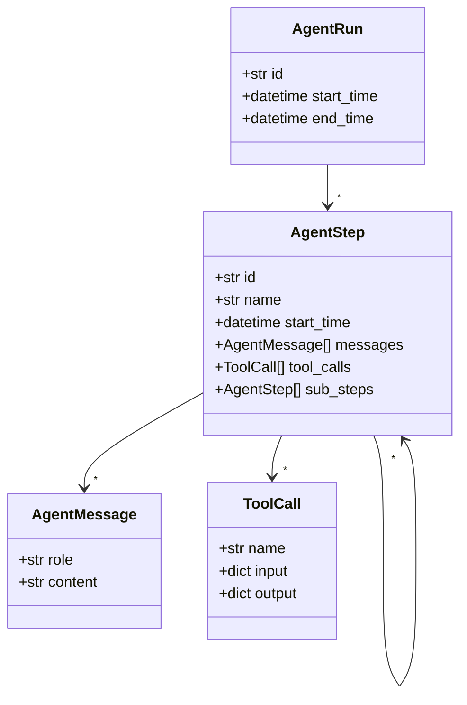

# Agent Log Ontology

This repository provides a comprehensive ontology for autonomous agent execution logs. It includes both a minimal implementation and an enhanced seven-layer architecture designed for enterprise-scale agent oversight platforms. The ontology is implemented with Pydantic models and includes connectors for various agent formats.



## Enhanced Ontology

The repository now includes a comprehensive seven-layer ontology for enterprise agent oversight:

- **Identity Layer**: Agent identification and capabilities
- **Perception Layer**: Input processing and observation
- **Cognition Layer**: Reasoning, knowledge, and metacognition
- **Action Layer**: Planning and execution
- **State Layer**: Comprehensive state management
- **Interaction Layer**: Communication interfaces
- **Oversight Layer**: Monitoring, anomaly detection, and compliance

See [ENHANCED_ONTOLOGY.md](ENHANCED_ONTOLOGY.md) for detailed documentation.

## Quick start

```bash
pip install -e .[dev]
pre-commit install
make test
```

## Adding a Connector

1. Create a new module in `agent_log_ontology/connectors/` with a `from_<source>()` function returning `AgentRun`.
2. Write a sample log in `samples/` and a test in `tests/`.
3. Run `make test` to ensure the new connector works.
