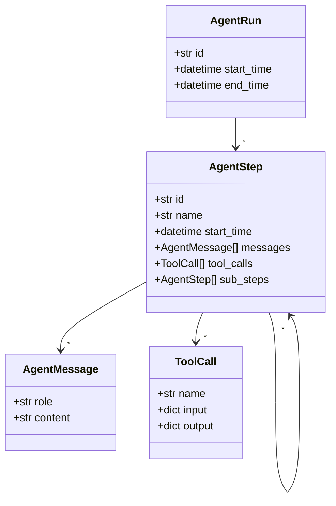

# Agent Log Ontology

This repository demonstrates a minimal ontology for autonomous agent execution logs. The ontology is implemented with Pydantic models and includes a connector for the OpenAI `agent-traces` format.



## Quick start

```bash
pip install -e .[dev]
pre-commit install
make test
```

## Adding a Connector

1. Create a new module in `agent_log_ontology/connectors/` with a `from_<source>()` function returning `AgentRun`.
2. Write a sample log in `samples/` and a test in `tests/`.
3. Run `make test` to ensure the new connector works.
